# Workflow diagrams: Flame in Freefall

| Owner | Status | Version | Last updated | Plan items | Code paths |
|---|---|---|---|---|---|
| Lead (Anas) | Draft | 1.0.0 | 2026-11-13 | T7 | whole repository |

This document draws the project's full workflow, from NASA's raw files to the dashboard, and from a branch to a merged release. Every diagram is Mermaid, so GitHub renders it in place. The text sources are [FINAL_ARCHITECTURE.md](../../FINAL_ARCHITECTURE.md), [overview.md](overview.md), [background-jobs.md](background-jobs.md), [INGESTION_PIPELINE.md](../data/INGESTION_PIPELINE.md), [retrieval-pipeline.md](../ai/retrieval-pipeline.md) and the code paths named in each section. Where a diagram and the code disagree, the code wins.

## Contents

1. [System context](#1-system-context)
2. [End-to-end workflow](#2-end-to-end-workflow)
3. [Data acquisition and provenance](#3-data-acquisition-and-provenance)
4. [Ingestion, per file](#4-ingestion-per-file)
5. [Knowledge versions and cache invalidation](#5-knowledge-versions-and-cache-invalidation)
6. [Knowledge graph build and query](#6-knowledge-graph-build-and-query)
7. [Stack start-up](#7-stack-start-up)
8. [Request path: web proxy, auth, rate limits](#8-request-path-web-proxy-auth-rate-limits)
9. [Fire-safety scenario workflow](#9-fire-safety-scenario-workflow)
10. [FLEX outcome model lifecycle](#10-flex-outcome-model-lifecycle)
11. [Search pipeline](#11-search-pipeline)
12. [Chat (grounded RAG)](#12-chat-grounded-rag)
13. [Model router](#13-model-router)
14. [Image and video analysis jobs](#14-image-and-video-analysis-jobs)
15. [Video checkpoints, resume and cancel](#15-video-checkpoints-resume-and-cancel)
16. [Stuck-job recovery](#16-stuck-job-recovery)
17. [Web app page map](#17-web-app-page-map)
18. [AURA integration (Link 2)](#18-aura-integration-link-2)
19. [Development workflow](#19-development-workflow)
20. [CI gates](#20-ci-gates)

---

## 1. System context

Who and what talks to Flame. Solid arrows are always on; dotted arrows are optional.

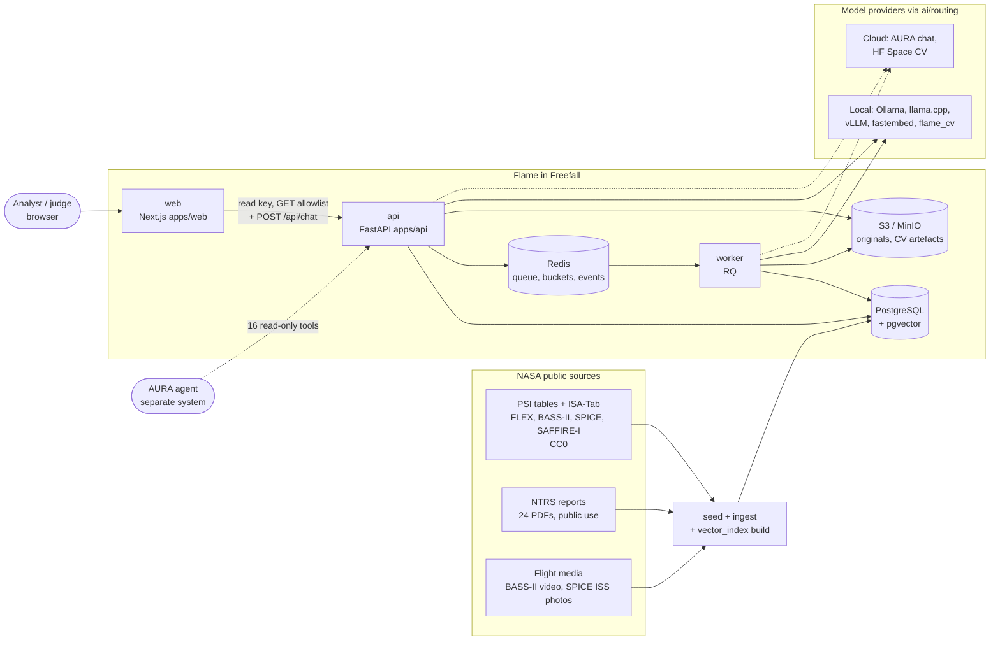
```mermaid
flowchart LR
    subgraph NASA["NASA public sources"]
        PSI["PSI tables + ISA-Tab<br/>FLEX, BASS-II, SPICE, SAFFIRE-I<br/>CC0"]
        NTRS["NTRS reports<br/>24 PDFs, public use"]
        MEDIA["Flight media<br/>BASS-II video, SPICE ISS photos"]
    end

    USER(["Analyst / judge<br/>browser"])
    AURA(["AURA agent<br/>separate system"])

    subgraph FLAME["Flame in Freefall"]
        WEB["web<br/>Next.js apps/web"]
        API["api<br/>FastAPI apps/api"]
        WORKER["worker<br/>RQ"]
        PG[("PostgreSQL<br/>+ pgvector")]
        REDIS[("Redis<br/>queue, buckets, events")]
        S3[("S3 / MinIO<br/>originals, CV artefacts")]
    end

    subgraph MODELS["Model providers via ai/routing"]
        LOCAL["Local: Ollama, llama.cpp,<br/>vLLM, fastembed, flame_cv"]
        CLOUD["Cloud: AURA chat,<br/>HF Space CV"]
    end

    PSI --> INGEST["seed + ingest<br/>+ vector_index build"]
    NTRS --> INGEST
    MEDIA --> INGEST
    INGEST --> PG

    USER --> WEB
    WEB -->|"read key, GET allowlist<br/>+ POST /api/chat"| API
    AURA -.->|"16 read-only tools"| API
    API --> PG
    API --> REDIS
    API --> S3
    REDIS --> WORKER
    WORKER --> PG
    WORKER --> S3
    API --> LOCAL
    API -.-> CLOUD
    WORKER --> LOCAL
    WORKER -.-> CLOUD
```

## 2. End-to-end workflow

The life of one number, from a NASA spreadsheet cell to a cited insight on the dashboard.

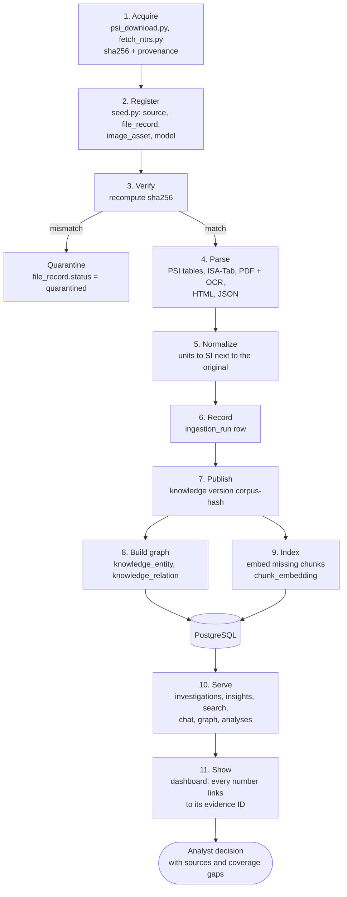
```mermaid
flowchart TB
    A["1. Acquire<br/>psi_download.py, fetch_ntrs.py<br/>sha256 + provenance"] --> B["2. Register<br/>seed.py: source, file_record,<br/>image_asset, model"]
    B --> C["3. Verify<br/>recompute sha256"]
    C -->|mismatch| Q["Quarantine<br/>file_record.status = quarantined"]
    C -->|match| D["4. Parse<br/>PSI tables, ISA-Tab, PDF + OCR,<br/>HTML, JSON"]
    D --> E["5. Normalize<br/>units to SI next to the original"]
    E --> F["6. Record<br/>ingestion_run row"]
    F --> G["7. Publish<br/>knowledge version corpus-hash"]
    G --> H["8. Build graph<br/>knowledge_entity, knowledge_relation"]
    G --> I["9. Index<br/>embed missing chunks<br/>chunk_embedding"]
    H --> J[("PostgreSQL")]
    I --> J
    J --> K["10. Serve<br/>investigations, insights, search,<br/>chat, graph, analyses"]
    K --> L["11. Show<br/>dashboard: every number links<br/>to its evidence ID"]
    L --> M(["Analyst decision<br/>with sources and coverage gaps"])
```

## 3. Data acquisition and provenance

Done once, while connected. The output is committed, so a fresh clone needs no network for the tables.

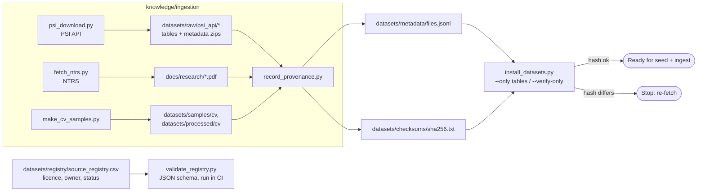
```mermaid
flowchart LR
    subgraph Acquire["knowledge/ingestion"]
        P1["psi_download.py<br/>PSI API"] --> RAW["datasets/raw/psi_api/*<br/>tables + metadata zips"]
        P2["fetch_ntrs.py<br/>NTRS"] --> PDF["docs/research/*.pdf"]
        P3["make_cv_samples.py"] --> CV["datasets/samples/cv,<br/>datasets/processed/cv"]
        RAW --> PROV["record_provenance.py"]
        PDF --> PROV
        CV --> PROV
    end
    PROV --> FILES["datasets/metadata/files.jsonl"]
    PROV --> SUMS["datasets/checksums/sha256.txt"]
    REG["datasets/registry/source_registry.csv<br/>licence, owner, status"] --> VAL["validate_registry.py<br/>JSON schema, run in CI"]
    FILES --> INST["install_datasets.py<br/>--only tables / --verify-only"]
    SUMS --> INST
    INST -->|"hash ok"| READY(["Ready for seed + ingest"])
    INST -->|"hash differs"| FAIL(["Stop: re-fetch"])
```

## 4. Ingestion, per file

`apps/api/flame_api/ingest.py`. Each file is parsed inside a savepoint, so a quarantined file leaves nothing behind. IDs are stable ULIDs of content keys and every write is a merge, so a rerun converges.

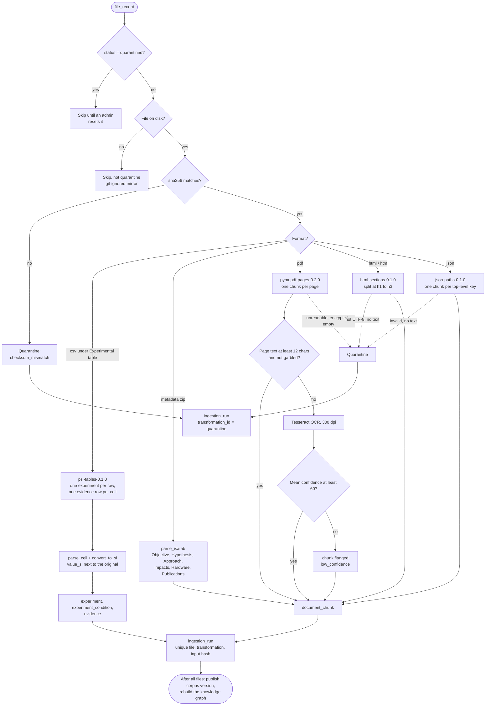
```mermaid
flowchart TD
    S(["file_record"]) --> ST{"status = quarantined?"}
    ST -->|yes| SKIP1["Skip until an admin<br/>resets it"]
    ST -->|no| DISK{"File on disk?"}
    DISK -->|no| SKIP2["Skip, not quarantine<br/>git-ignored mirror"]
    DISK -->|yes| SHA{"sha256 matches?"}
    SHA -->|no| QU["Quarantine:<br/>checksum_mismatch"]
    SHA -->|yes| TYPE{"Format?"}

    TYPE -->|"csv under Experimental table"| T1["psi-tables-0.1.0<br/>one experiment per row,<br/>one evidence row per cell"]
    TYPE -->|"metadata zip"| T2["parse_isatab<br/>Objective, Hypothesis, Approach,<br/>Impacts, Hardware, Publications"]
    TYPE -->|pdf| T3["pymupdf-pages-0.2.0<br/>one chunk per page"]
    TYPE -->|"html / htm"| T4["html-sections-0.1.0<br/>split at h1 to h3"]
    TYPE -->|json| T5["json-paths-0.1.0<br/>one chunk per top-level key"]

    T3 --> PG1{"Page text at least 12 chars<br/>and not garbled?"}
    PG1 -->|yes| CH["document_chunk"]
    PG1 -->|no| OCR["Tesseract OCR, 300 dpi"]
    OCR --> CONF{"Mean confidence at least 60?"}
    CONF -->|yes| CH
    CONF -->|no| LOW["chunk flagged<br/>low_confidence"]
    LOW --> CH
    T3 -.->|"unreadable, encrypted, empty"| QU2["Quarantine"]
    T4 -.->|"not UTF-8, no text"| QU2
    T5 -.->|"invalid, no text"| QU2

    T1 --> NORM["parse_cell + convert_to_si<br/>value_si next to the original"]
    NORM --> EXP["experiment, experiment_condition,<br/>evidence"]
    T2 --> CH
    T4 --> CH
    T5 --> CH

    EXP --> RUN["ingestion_run<br/>unique file, transformation, input hash"]
    CH --> RUN
    QU --> RUNQ["ingestion_run<br/>transformation_id = quarantine"]
    QU2 --> RUNQ
    RUN --> END(["After all files: publish corpus version,<br/>rebuild the knowledge graph"])
```

## 5. Knowledge versions and cache invalidation

Every cache is keyed by the knowledge version, so new data never serves stale answers.

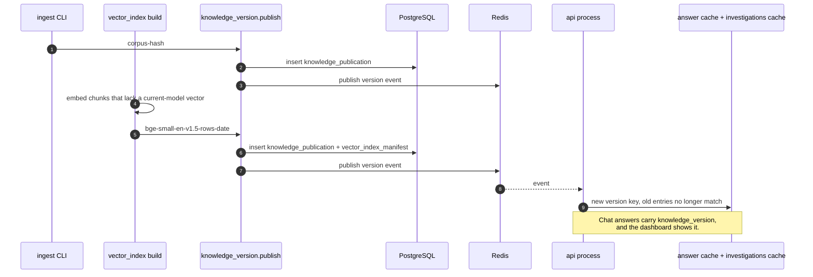
```mermaid
sequenceDiagram
    autonumber
    participant ING as ingest CLI
    participant VI as vector_index build
    participant KV as knowledge_version.publish
    participant PG as PostgreSQL
    participant R as Redis
    participant API as api process
    participant AC as answer cache + investigations cache

    ING->>KV: corpus-hash
    KV->>PG: insert knowledge_publication
    KV->>R: publish version event
    VI->>VI: embed chunks that lack a current-model vector
    VI->>KV: bge-small-en-v1.5-rows-date
    KV->>PG: insert knowledge_publication + vector_index_manifest
    KV->>R: publish version event
    R-->>API: event
    API->>AC: new version key, old entries no longer match
    Note over API,AC: Chat answers carry knowledge_version,<br/>and the dashboard shows it.
```

## 6. Knowledge graph build and query

ADR-007. Built from the PSI tables at the end of every ingest: 951 entities, 10,683 edges, each citing the cell it came from.

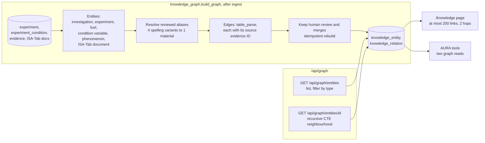
```mermaid
flowchart LR
    subgraph Build["knowledge_graph.build_graph, after ingest"]
        EXP[("experiment,<br/>experiment_condition,<br/>evidence, ISA-Tab docs")] --> ENT["Entities:<br/>investigation, experiment, fuel,<br/>condition variable, phenomenon,<br/>ISA-Tab document"]
        ENT --> ALIAS["Resolve reviewed aliases<br/>4 spelling variants to 1 material"]
        ALIAS --> EDGE["Edges: table_parse,<br/>each with its source evidence ID"]
        EDGE --> KEEP["Keep human review and merges<br/>idempotent rebuild"]
        KEEP --> KG[("knowledge_entity,<br/>knowledge_relation")]
    end

    subgraph Query["/api/graph"]
        L["GET /api/graph/entities<br/>list, filter by type"] --> KG
        D["GET /api/graph/entities/id<br/>recursive CTE neighbourhood"] --> KG
    end

    KG --> UI["/knowledge page<br/>at most 200 links, 2 hops"]
    KG --> AT["AURA tools<br/>two graph reads"]
```

## 7. Stack start-up

`infrastructure/compose.yaml`. The same commands run on Railway (`.railway/railway.py`).

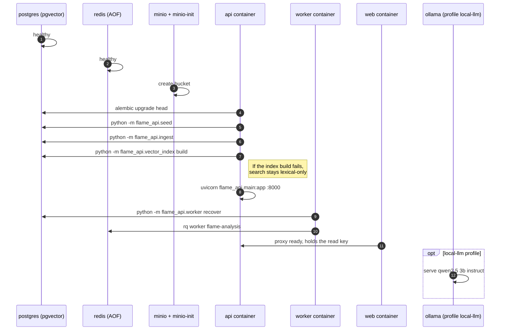
```mermaid
sequenceDiagram
    autonumber
    participant PG as postgres (pgvector)
    participant R as redis (AOF)
    participant M as minio + minio-init
    participant API as api container
    participant W as worker container
    participant WEB as web container
    participant OL as ollama (profile local-llm)

    PG->>PG: healthy
    R->>R: healthy
    M->>M: create bucket
    API->>PG: alembic upgrade head
    API->>PG: python -m flame_api.seed
    API->>PG: python -m flame_api.ingest
    API->>PG: python -m flame_api.vector_index build
    Note right of API: If the index build fails,<br/>search stays lexical-only
    API->>API: uvicorn flame_api.main:app :8000
    W->>PG: python -m flame_api.worker recover
    W->>R: rq worker flame-analysis
    WEB->>API: proxy ready, holds the read key
    opt local-llm profile
        OL->>OL: serve qwen2.5 3b instruct
    end
```

## 8. Request path: web proxy, auth, rate limits

ADR-009. The browser never holds a key. The web server holds the read key and forwards only an allowlist of GET paths plus `POST /api/chat`.

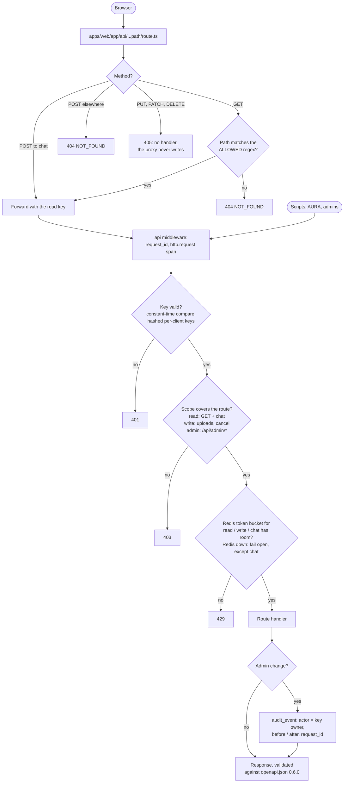
```mermaid
flowchart TD
    B(["Browser"]) --> P["apps/web/app/api/...path/route.ts"]
    AL{"Path matches the<br/>ALLOWED regex?"}
    P --> MET{"Method?"}
    MET -->|"POST to chat"| FWD["Forward with the read key"]
    MET -->|"POST elsewhere"| X404b["404 NOT_FOUND"]
    MET -->|"PUT, PATCH, DELETE"| X405["405: no handler,<br/>the proxy never writes"]
    MET -->|GET| AL
    AL -->|no| X404["404 NOT_FOUND"]
    AL -->|yes| FWD

    FWD --> MW["api middleware:<br/>request_id, http.request span"]
    SCRIPT(["Scripts, AURA, admins"]) --> MW
    MW --> AUTH{"Key valid?<br/>constant-time compare,<br/>hashed per-client keys"}
    AUTH -->|no| X401["401"]
    AUTH -->|yes| SCOPE{"Scope covers the route?<br/>read: GET + chat<br/>write: uploads, cancel<br/>admin: /api/admin/*"}
    SCOPE -->|no| X403["403"]
    SCOPE -->|yes| RL{"Redis token bucket for<br/>read / write / chat has room?<br/>Redis down: fail open, except chat"}
    RL -->|no| X429["429"]
    RL -->|yes| ROUTE["Route handler"]
    ROUTE --> AUD{"Admin change?"}
    AUD -->|yes| AE["audit_event: actor = key owner,<br/>before / after, request_id"]
    AUD -->|no| RESP["Response, validated<br/>against openapi.json 0.6.0"]
    AE --> RESP
```

## 9. Fire-safety scenario workflow

The core of the challenge answer: pick a cabin atmosphere, get ranked investigations and cited insights. `apps/api/flame_api/investigations.py` and `ai/fire_safety/`.

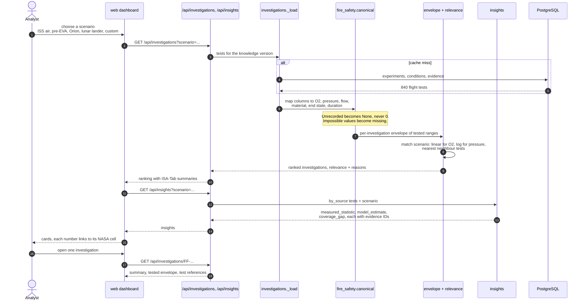
```mermaid
sequenceDiagram
    autonumber
    actor U as Analyst
    participant WEB as web dashboard
    participant API as /api/investigations, /api/insights
    participant LOAD as investigations._load
    participant CAN as fire_safety.canonical
    participant ENV as envelope + relevance
    participant INS as insights
    participant PG as PostgreSQL

    U->>WEB: choose a scenario<br/>ISS air, pre-EVA, Orion, lunar lander, custom
    WEB->>API: GET /api/investigations?scenario=...
    API->>LOAD: tests for the knowledge version
    alt cache miss
        LOAD->>PG: experiments, conditions, evidence
        PG-->>LOAD: 840 flight tests
    end
    LOAD->>CAN: map columns to O2, pressure, flow,<br/>material, end state, duration
    Note over CAN: Unrecorded becomes None, never 0.<br/>Impossible values become missing.
    CAN->>ENV: per-investigation envelope of tested ranges
    ENV->>ENV: match scenario: linear for O2, log for pressure,<br/>nearest neighbour tests
    ENV-->>API: ranked investigations, relevance + reasons
    API-->>WEB: ranking with ISA-Tab summaries
    WEB->>API: GET /api/insights?scenario=...
    API->>INS: by_source tests + scenario
    INS-->>API: measured_statistic, model_estimate,<br/>coverage_gap, each with evidence IDs
    API-->>WEB: insights
    WEB-->>U: cards, each number links to its NASA cell
    U->>WEB: open one investigation
    WEB->>API: GET /api/investigations/FF-...
    API-->>WEB: summary, tested envelope, test references
```

## 10. FLEX outcome model lifecycle

Trained offline with scikit-learn, served with numpy only. The model refuses to answer outside the tested domain.

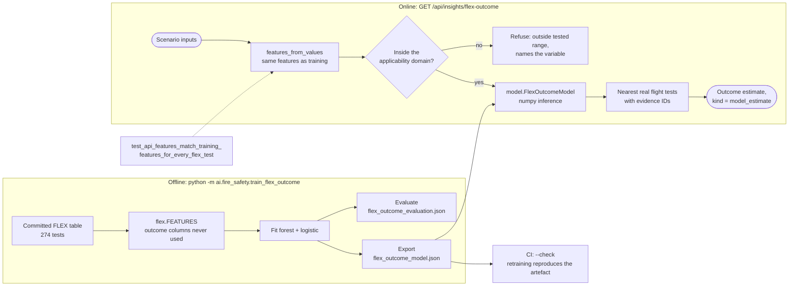
```mermaid
flowchart LR
    subgraph Offline["Offline: python -m ai.fire_safety.train_flex_outcome"]
        DATA["Committed FLEX table<br/>274 tests"] --> FEAT["flex.FEATURES<br/>outcome columns never used"]
        FEAT --> FIT["Fit forest + logistic"]
        FIT --> EVAL["Evaluate<br/>flex_outcome_evaluation.json"]
        FIT --> ART["Export<br/>flex_outcome_model.json"]
    end
    ART --> CHECK["CI: --check<br/>retraining reproduces the artefact"]

    subgraph Online["Online: GET /api/insights/flex-outcome"]
        REQ(["Scenario inputs"]) --> FV["features_from_values<br/>same features as training"]
        FV --> APP{"Inside the<br/>applicability domain?"}
        APP -->|no| REF["Refuse: outside tested range,<br/>names the variable"]
        APP -->|yes| RUN["model.FlexOutcomeModel<br/>numpy inference"]
        RUN --> NN["Nearest real flight tests<br/>with evidence IDs"]
        NN --> OUT(["Outcome estimate,<br/>kind = model_estimate"])
    end
    ART --> RUN
    T["test_api_features_match_training_<br/>features_for_every_flex_test"] -.-> FV
```

## 11. Search pipeline

ADR-006, `ai/rag/retrieval/search_stack.py` (`flame-search-2.0.0`). The API only fetches candidates; ranking lives in `ai/rag`.

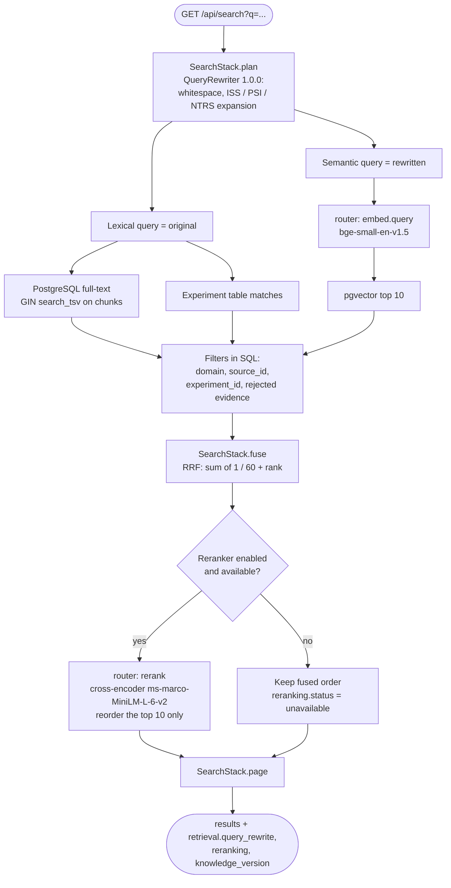
```mermaid
flowchart TD
    Q(["GET /api/search?q=..."]) --> PLAN["SearchStack.plan<br/>QueryRewriter 1.0.0:<br/>whitespace, ISS / PSI / NTRS expansion"]
    PLAN --> LQ["Lexical query = original"]
    PLAN --> SQ["Semantic query = rewritten"]

    LQ --> FTS["PostgreSQL full-text<br/>GIN search_tsv on chunks"]
    LQ --> EXPQ["Experiment table matches"]
    SQ --> EMB["router: embed.query<br/>bge-small-en-v1.5"]
    EMB --> VEC["pgvector top 10"]

    FTS --> FILT["Filters in SQL:<br/>domain, source_id,<br/>experiment_id, rejected evidence"]
    EXPQ --> FILT
    VEC --> FILT

    FILT --> FUSE["SearchStack.fuse<br/>RRF: sum of 1 / 60 + rank"]
    FUSE --> RR{"Reranker enabled<br/>and available?"}
    RR -->|yes| CE["router: rerank<br/>cross-encoder ms-marco-MiniLM-L-6-v2<br/>reorder the top 10 only"]
    RR -->|no| KEEP["Keep fused order<br/>reranking.status = unavailable"]
    CE --> PAGE["SearchStack.page"]
    KEEP --> PAGE
    PAGE --> R(["results + retrieval.query_rewrite,<br/>reranking, knowledge_version"])
```

## 12. Chat (grounded RAG)

`POST /api/chat`. The model only sees retrieved passages, on a data channel, and any citation outside the retrieved set is dropped.

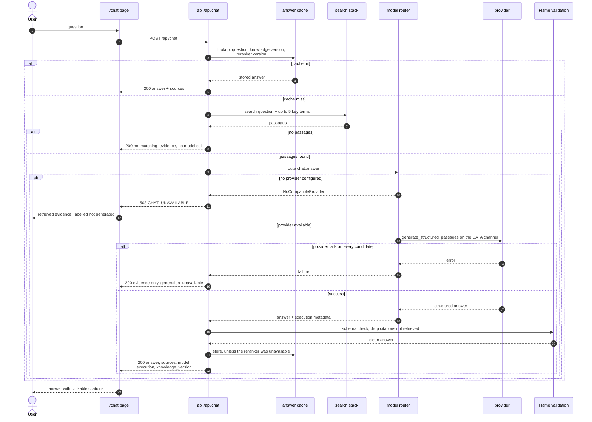
```mermaid
sequenceDiagram
    autonumber
    actor U as User
    participant WEB as /chat page
    participant API as api /api/chat
    participant AC as answer cache
    participant SS as search stack
    participant RT as model router
    participant LLM as provider
    participant VAL as Flame validation

    U->>WEB: question
    WEB->>API: POST /api/chat
    API->>AC: lookup: question, knowledge version,<br/>reranker version
    alt cache hit
        AC-->>API: stored answer
        API-->>WEB: 200 answer + sources
    else cache miss
        API->>SS: search question + up to 5 key terms
        SS-->>API: passages
        alt no passages
            API-->>WEB: 200 no_matching_evidence, no model call
        else passages found
            API->>RT: route chat.answer
            alt no provider configured
                RT-->>API: NoCompatibleProvider
                API-->>WEB: 503 CHAT_UNAVAILABLE
                WEB-->>U: retrieved evidence, labelled not generated
            else provider available
                RT->>LLM: generate_structured, passages on the DATA channel
                alt provider fails on every candidate
                    LLM-->>RT: error
                    RT-->>API: failure
                    API-->>WEB: 200 evidence-only, generation_unavailable
                else success
                    LLM-->>RT: structured answer
                    RT-->>API: answer + execution metadata
                    API->>VAL: schema check, drop citations not retrieved
                    VAL-->>API: clean answer
                    API->>AC: store, unless the reranker was unavailable
                    API-->>WEB: 200 answer, sources, model,<br/>execution, knowledge_version
                end
            end
        end
    end
    WEB-->>U: answer with clickable citations
```

## 13. Model router

ADR-003, `ai/routing/router.py` and `policies.py`. One entry point for every model task: `chat.answer`, `analysis.interpret`, `text.generate`, `embed.query`, `embed.documents`, `rerank`, `vision.analyze`, `video.analyze`, `speech.transcribe`.

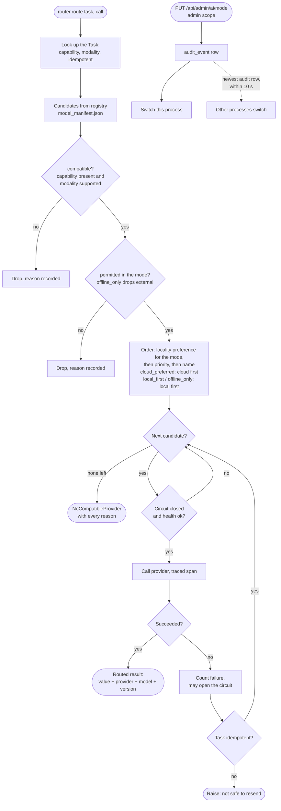
```mermaid
flowchart TD
    CALL(["router.route task, call"]) --> T["Look up the Task:<br/>capability, modality, idempotent"]
    T --> C1["Candidates from registry<br/>model_manifest.json"]
    C1 --> F1{"compatible?<br/>capability present and<br/>modality supported"}
    F1 -->|no| DROP1["Drop, reason recorded"]
    F1 -->|yes| F2{"permitted in the mode?<br/>offline_only drops external"}
    F2 -->|no| DROP2["Drop, reason recorded"]
    F2 -->|yes| ORD["Order: locality preference for the mode,<br/>then priority, then name<br/>cloud_preferred: cloud first<br/>local_first / offline_only: local first"]
    ORD --> NEXT{"Next candidate?"}
    NEXT -->|none left| NCP(["NoCompatibleProvider<br/>with every reason"])
    NEXT -->|yes| CB{"Circuit closed<br/>and health ok?"}
    CB -->|no| NEXT
    CB -->|yes| INV["Call provider, traced span"]
    INV --> OK{"Succeeded?"}
    OK -->|yes| RES(["Routed result:<br/>value + provider + model + version"])
    OK -->|no| CNT["Count failure,<br/>may open the circuit"]
    CNT --> IDEM{"Task idempotent?"}
    IDEM -->|yes| NEXT
    IDEM -->|no| ERR(["Raise: not safe to resend"])

    ADMIN(["PUT /api/admin/ai/mode<br/>admin scope"]) --> AUD["audit_event row"]
    AUD --> SW["Switch this process"]
    AUD -.->|"newest audit row,<br/>within 10 s"| OTHER["Other processes switch"]
```

## 14. Image and video analysis jobs

`apps/api/flame_api/analysis.py` and `worker.py`. The status lives in PostgreSQL, not only in RQ, so it survives a Redis or API restart.

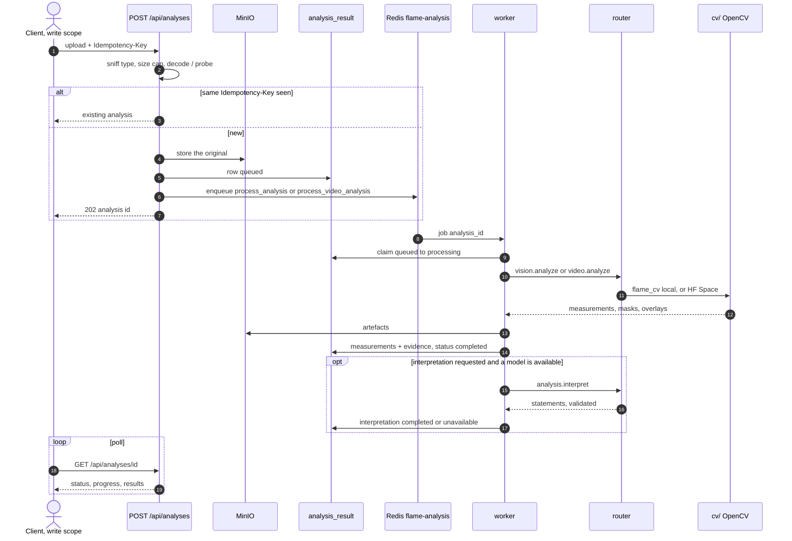
```mermaid
sequenceDiagram
    autonumber
    actor C as Client, write scope
    participant API as POST /api/analyses
    participant S3 as MinIO
    participant PG as analysis_result
    participant Q as Redis flame-analysis
    participant W as worker
    participant RT as router
    participant CV as cv/ OpenCV

    C->>API: upload + Idempotency-Key
    API->>API: sniff type, size cap, decode / probe
    alt same Idempotency-Key seen
        API-->>C: existing analysis
    else new
        API->>S3: store the original
        API->>PG: row queued
        API->>Q: enqueue process_analysis or process_video_analysis
        API-->>C: 202 analysis id
    end
    Q->>W: job analysis_id
    W->>PG: claim queued to processing
    W->>RT: vision.analyze or video.analyze
    RT->>CV: flame_cv local, or HF Space
    CV-->>W: measurements, masks, overlays
    W->>S3: artefacts
    W->>PG: measurements + evidence, status completed
    opt interpretation requested and a model is available
        W->>RT: analysis.interpret
        RT-->>W: statements, validated
        W->>PG: interpretation completed or unavailable
    end
    loop poll
        C->>API: GET /api/analyses/id
        API-->>C: status, progress, results
    end
```

Status state machine:

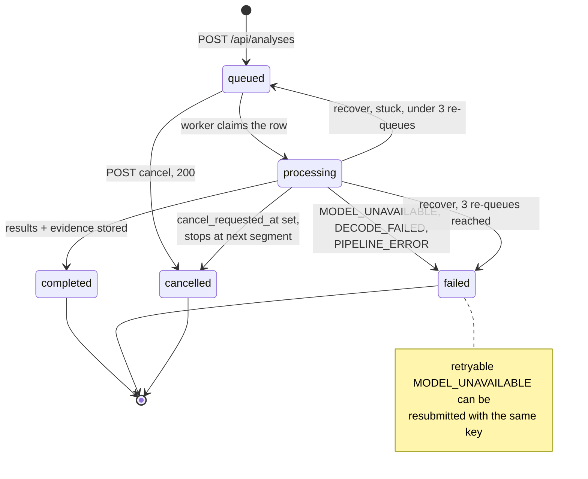
```mermaid
stateDiagram-v2
    [*] --> queued: POST /api/analyses
    queued --> processing: worker claims the row
    queued --> cancelled: POST cancel, 200
    processing --> completed: results + evidence stored
    processing --> failed: MODEL_UNAVAILABLE, DECODE_FAILED,<br/>PIPELINE_ERROR
    processing --> cancelled: cancel_requested_at set,<br/>stops at next segment
    processing --> queued: recover, stuck, under 3 re-queues
    processing --> failed: recover, 3 re-queues reached
    completed --> [*]
    failed --> [*]
    cancelled --> [*]
    note right of failed
        retryable MODEL_UNAVAILABLE can be
        resubmitted with the same key
    end note
```

## 15. Video checkpoints, resume and cancel

ADR-008. A crash loses at most one segment, and the resumed result is identical frame for frame.

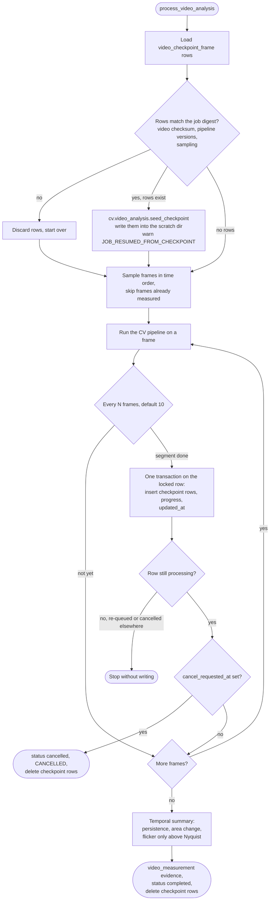
```mermaid
flowchart TD
    START(["process_video_analysis"]) --> LOAD["Load video_checkpoint_frame rows"]
    LOAD --> DIG{"Rows match the job digest?<br/>video checksum, pipeline versions,<br/>sampling"}
    DIG -->|no| DISC["Discard rows, start over"]
    DIG -->|yes, rows exist| SEED["cv.video_analysis.seed_checkpoint<br/>write them into the scratch dir<br/>warn JOB_RESUMED_FROM_CHECKPOINT"]
    DIG -->|no rows| SAMP
    DISC --> SAMP
    SEED --> SAMP["Sample frames in time order,<br/>skip frames already measured"]
    SAMP --> FR["Run the CV pipeline on a frame"]
    FR --> SEG{"Every N frames, default 10"}
    SEG -->|not yet| MORE
    SEG -->|segment done| TX["One transaction on the locked row:<br/>insert checkpoint rows, progress,<br/>updated_at"]
    TX --> STILL{"Row still processing?"}
    STILL -->|no, re-queued or cancelled elsewhere| STOP1(["Stop without writing"])
    STILL -->|yes| CAN{"cancel_requested_at set?"}
    CAN -->|yes| CXL(["status cancelled, CANCELLED,<br/>delete checkpoint rows"])
    CAN -->|no| MORE{"More frames?"}
    MORE -->|yes| FR
    MORE -->|no| TEMP["Temporal summary:<br/>persistence, area change,<br/>flicker only above Nyquist"]
    TEMP --> DONE(["video_measurement evidence,<br/>status completed,<br/>delete checkpoint rows"])
```

## 16. Stuck-job recovery

`python -m flame_api.worker recover`, run once at every worker start.

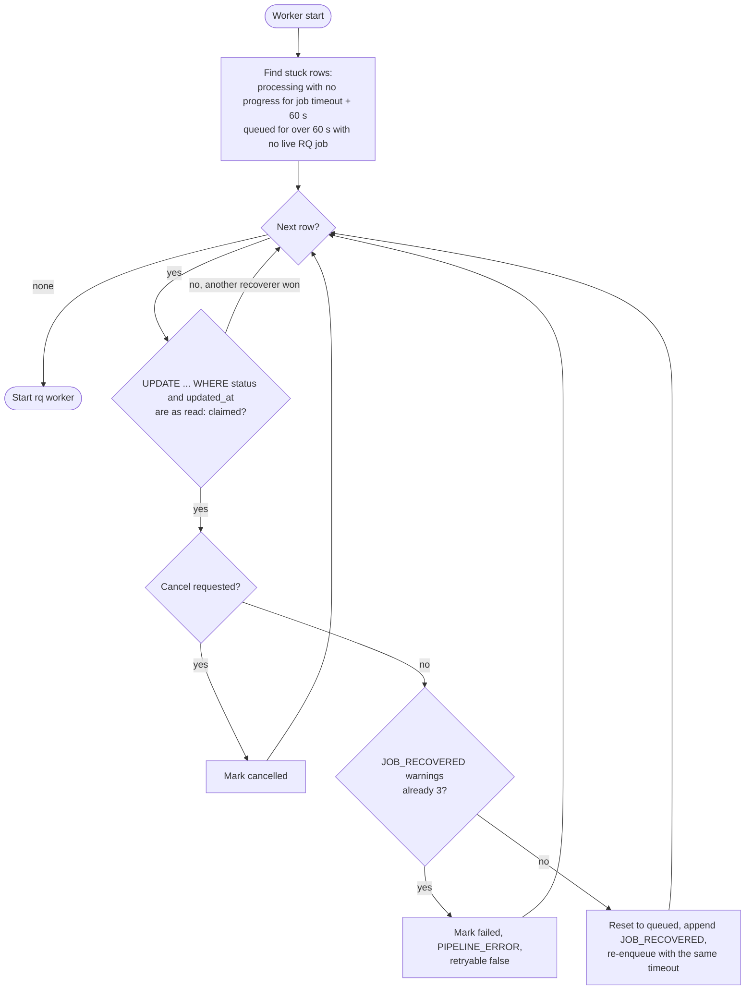
```mermaid
flowchart TD
    S(["Worker start"]) --> FIND["Find stuck rows:<br/>processing with no progress for job timeout + 60 s<br/>queued for over 60 s with no live RQ job"]
    FIND --> EACH{"Next row?"}
    EACH -->|none| RQ(["Start rq worker"])
    EACH -->|yes| CLAIM{"UPDATE ... WHERE status and updated_at<br/>are as read: claimed?"}
    CLAIM -->|no, another recoverer won| EACH
    CLAIM -->|yes| CX{"Cancel requested?"}
    CX -->|yes| MC["Mark cancelled"] --> EACH
    CX -->|no| N{"JOB_RECOVERED warnings<br/>already 3?"}
    N -->|yes| MF["Mark failed, PIPELINE_ERROR,<br/>retryable false"] --> EACH
    N -->|no| RE["Reset to queued, append JOB_RECOVERED,<br/>re-enqueue with the same timeout"] --> EACH
```

## 17. Web app page map

`apps/web/app`. Every page reads through the same-origin proxy.

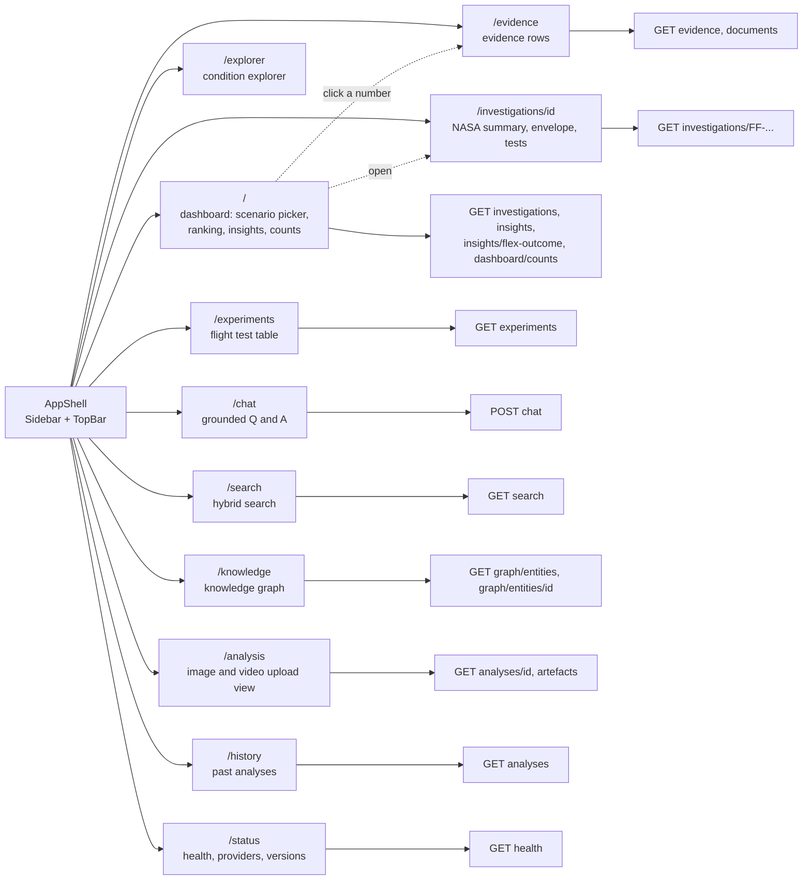
```mermaid
flowchart LR
    SHELL["AppShell<br/>Sidebar + TopBar"] --> HOME["/<br/>dashboard: scenario picker,<br/>ranking, insights, counts"]
    SHELL --> INV["/investigations/id<br/>NASA summary, envelope, tests"]
    SHELL --> EXPL["/explorer<br/>condition explorer"]
    SHELL --> EXPS["/experiments<br/>flight test table"]
    SHELL --> CHAT["/chat<br/>grounded Q and A"]
    SHELL --> SRCH["/search<br/>hybrid search"]
    SHELL --> KNOW["/knowledge<br/>knowledge graph"]
    SHELL --> ANA["/analysis<br/>image and video upload view"]
    SHELL --> HIST["/history<br/>past analyses"]
    SHELL --> EVID["/evidence<br/>evidence rows"]
    SHELL --> STAT["/status<br/>health, providers, versions"]

    HOME --> E1["GET investigations, insights,<br/>insights/flex-outcome, dashboard/counts"]
    INV --> E2["GET investigations/FF-..."]
    EXPS --> E3["GET experiments"]
    CHAT --> E4["POST chat"]
    SRCH --> E5["GET search"]
    KNOW --> E6["GET graph/entities, graph/entities/id"]
    ANA --> E7["GET analyses/id, artefacts"]
    HIST --> E8["GET analyses"]
    EVID --> E9["GET evidence, documents"]
    STAT --> E10["GET health"]
    HOME -.->|click a number| EVID
    HOME -.->|open| INV
```

## 18. AURA integration (Link 2)

ADR-004. AURA is a separate system. It discovers Flame's OpenAPI contract and compiles the safe reads into agent tools.

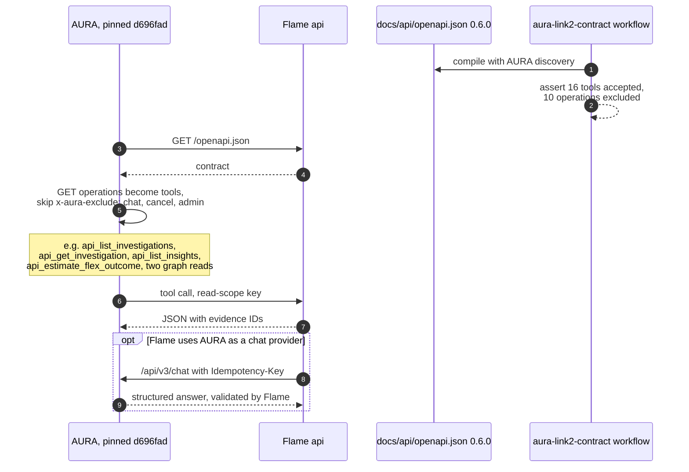
```mermaid
sequenceDiagram
    autonumber
    participant AURA as AURA, pinned d696fad
    participant API as Flame api
    participant SPEC as docs/api/openapi.json 0.6.0
    participant CI as aura-link2-contract workflow

    CI->>SPEC: compile with AURA discovery
    CI-->>CI: assert 16 tools accepted,<br/>10 operations excluded
    AURA->>API: GET /openapi.json
    API-->>AURA: contract
    AURA->>AURA: GET operations become tools,<br/>skip x-aura-exclude: chat, cancel, admin
    Note over AURA: e.g. api_list_investigations,<br/>api_get_investigation, api_list_insights,<br/>api_estimate_flex_outcome, two graph reads
    AURA->>API: tool call, read-scope key
    API-->>AURA: JSON with evidence IDs
    opt Flame uses AURA as a chat provider
        API->>AURA: /api/v3/chat with Idempotency-Key
        AURA-->>API: structured answer, validated by Flame
    end
```

## 19. Development workflow

How a change gets from an idea to `main`. Docs and contracts move in the same pull request as the code.

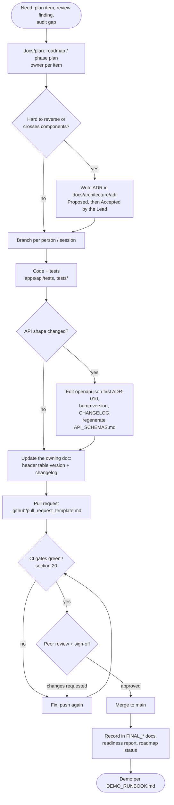
```mermaid
flowchart TD
    IDEA(["Need: plan item, review finding,<br/>audit gap"]) --> PLAN["docs/plan: roadmap / phase plan<br/>owner per item"]
    PLAN --> ADRQ{"Hard to reverse or<br/>crosses components?"}
    ADRQ -->|yes| ADR["Write ADR in docs/architecture/adr<br/>Proposed, then Accepted by the Lead"]
    ADRQ -->|no| BR
    ADR --> BR["Branch per person / session"]
    BR --> CODE["Code + tests<br/>apps/api/tests, tests/"]
    CODE --> CON{"API shape changed?"}
    CON -->|yes| SPEC["Edit openapi.json first ADR-010,<br/>bump version, CHANGELOG,<br/>regenerate API_SCHEMAS.md"]
    CON -->|no| DOCS
    SPEC --> DOCS["Update the owning doc:<br/>header table version + changelog"]
    DOCS --> PR["Pull request<br/>.github/pull_request_template.md"]
    PR --> CI{"CI gates green?<br/>section 20"}
    CI -->|no| FIX["Fix, push again"] --> CI
    CI -->|yes| REV{"Peer review + sign-off"}
    REV -->|changes requested| FIX
    REV -->|approved| MERGE["Merge to main"]
    MERGE --> REC["Record in FINAL_* docs,<br/>readiness report, roadmap status"]
    REC --> DEMO(["Demo per DEMO_RUNBOOK.md"])
```

## 20. CI gates

`.github/workflows/ci.yml`, on every pull request and every push to `main`. Each job is a required check.

```mermaid
flowchart LR
    TRIG(["pull_request / push to main"]) --> PY
    TRIG --> MIG
    TRIG --> WEBJ
    TRIG --> SEC
    TRIG --> AURAJ

    subgraph PY["python"]
        direction TB
        P1["Install Tesseract, CPU torch,<br/>apps/api extras, ai deps"] --> P2["ruff check ."]
        P2 --> P3["validate_registry.py"]
        P3 --> P4["render_api_schemas.py --check"]
        P4 --> P5["pytest: tests/ + apps/api/tests"]
    end

    subgraph MIG["migrations"]
        direction TB
        M1["pgvector pg16 service"] --> M2["alembic upgrade head"]
        M2 --> M3["downgrade -1, upgrade head"]
        M3 --> M4["seed, ingest, ingest again:<br/>second run creates nothing"]
    end

    subgraph WEBJ["web"]
        direction TB
        W1["npm ci"] --> W2["lint"] --> W3["typecheck"] --> W4["build"]
    end

    subgraph SEC["secrets"]
        direction TB
        S1["gitleaks 8.28.0, checksum-pinned"] --> S2["scan full history"]
    end

    subgraph AURAJ["aura-link2-contract"]
        direction TB
        A1["Compile openapi.json with AURA"] --> A2["Tool set as expected"]
    end

    PY --> GATE{"All green?"}
    MIG --> GATE
    WEBJ --> GATE
    SEC --> GATE
    AURAJ --> GATE
    GATE -->|yes| OK(["Mergeable"])
    GATE -->|no| NO(["Blocked"])
```

## Known limitations

- The diagrams describe `main` at `dcc89dc` (2026-11-12). Section 18's CI job is summarized; its exact steps are in `.github/workflows/aura-link2-contract.yml`.
- Section 17 lists each page's main endpoints, not every call.
- Graph RAG in chat is not built, so no diagram shows it.

## Changelog

- 1.0.0 (2026-11-13): first version, 20 sections.
